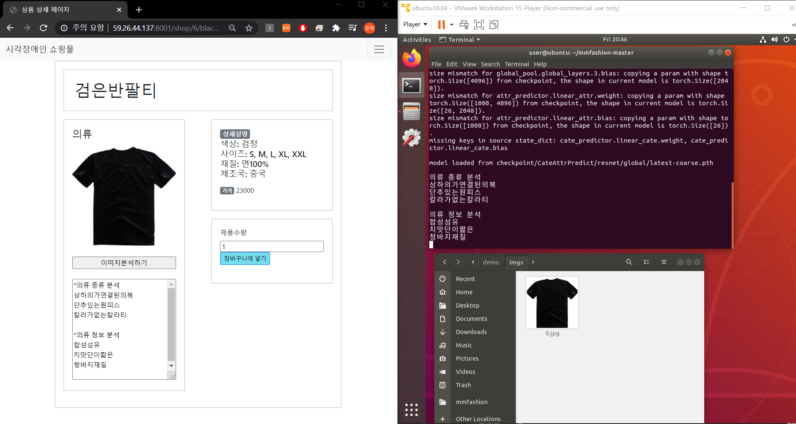

# clothing_category_attribute_classification-with_Pytorch
> 시각장애인을 위한 웹 쇼핑몰 개발 중 이미지 분석(Torch 버전) - 의복 종류 및 정보 분석

## 개발기간
* 2020.03.02.~06.22. (약4개월)

## 주요 기능
* 이미지 처리를 통한 사물 인식 및 판단
* TTS 엔진을 활용한 음성 출력
* 키보드만으로 사용할 수 있는 홈페이지

## 상세 내용
* 이미지분석서버 : 입력받은 의복 이미지에 대해 의복 종류 및 디자인이나 재질 등의 기타 정보를 분석하는 기능 수행
* 웹 서버 : 웹 쇼핑몰을 동작시킴
* 작동원리
    1. 이미지분석서버와 웹 서버는 TCP/IP 소켓으로 연결함
    2. 웹에서 상품 분석을 요청하면 이미지분석서버에서 상품 사진을 다운로드하고 분석을 수행함. 
    3. 분석 결과인 의복의 종류 및 정보를 웹에 반환함

* setup.py : 필수 파이썬 모듈 설치
* server.py : 웹 쇼핑몰이 분석 요청할 수 있도록 소켓 통신 시작
* get_img.py : 웹 쇼핑몰로부터 의류 사진을 얻기 위한 코드

* demo/test_cate_attr_predictor.py : 의류 사진에 대해 의복 종류 및 정보를 분석
* core-evaluation/cate_predict_demo.py : 의복 종류 분석
* core-evaluation/attr_predict_demo.py : 의복 정보 분석  

* data/Attr_Predict/Anno_fine/list_category_cloth.txt
   * 분류할 수 있는 의복 종류는 50개   
   * 현재 한글로 지정되어 있음, 필요에 따라 아래 파일들을 옮기고 이름을 변경하여 사용 가능  
   * 순영어: list_cloth/list_category_cloth-eng.txt   
   * 한영: list_cloth/list_category_cloth-engkor.txt

* data/Attr_Predict/Anno_fine/list_attr_cloth.txt
   * 분류할 수 있는 의복 정보는 26개   
   * 현재 한글로 지정되어 있음, 필요에 따라 아래 파일들을 옮기고 이름을 변경하여 사용 가능   
   * 순영어: list_cloth/list_attr_cloth-eng.txt   
   * 한영: list_attr_cloth-engkor.txt

## Development setup
* OS: Ubuntu 18.04
* Framwork: 
    * Torch 1.6.0+cu101
    * mmfashion 0.4.0 (토치 기반)
* Deep Learning Network:
    * Resnet50 (데이터셋 개발자 제공)
    * 50개의 종류와 26개의 디자인 구분 가능. 단, 재현도가 낮음. 
* Dataset: Deep Fashion Database
* Python 3.6.9

## Release History

* 1.0.0
    * first commit
    * 의복종류(category)와 의복정보(attribute) 분석에 대한 코드
    * 개선사항: 성능이 다소 아쉬움

## Contact

김준혁 – kimjunhyeok.it@gmail.com
